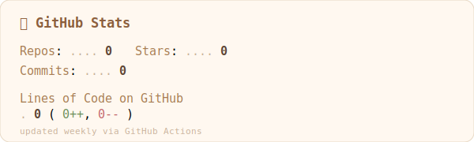

<map name="profilemap">
  <area shape="rect" coords="157,116,277,142" href="https://www.linkedin.com/in/rishkano" target="_blank" alt="LinkedIn"/>
  <area shape="rect" coords="285,116,395,142" href="https://rishkano.com" target="_blank" alt="Website"/>
</map>

